<!--
  Banner: pure SMIL animation, no JavaScript (GitHub strips scripts).
  Theme: deep-space starfield with pulsing "intel beacon" rings.
-->

<div align="center">



# 🛰️ Frontier Intel Cache

**On-chain proof. Off-chain payload.**
Verifiable, persistent intelligence reports for on-chain games — built on Sui and Walrus.

[](https://frontier.baserep.xyz)
[](https://suiscan.xyz/testnet)
[](https://walrus.xyz)
[](LICENSE)

<sub>Tech: Sui Move · Walrus · Tatum RPC · FastAPI · React · Vite · Three.js · Tailwind</sub>

</div>

---

> **The problem nobody else is solving:** on-chain games like EVE Frontier need verifiable, persistent intelligence — kill reports, scout sightings, threat assessments — that any player can post and any player can trust. Storing that intel directly on Sui costs ~$0.10+ per kilobyte. A single screenshot would cost twenty dollars. So games just... don't.
>
> **Frontier Intel Cache** breaks the wall: the *proof* of intel (who, when, where, what, hash) lives on Sui in a tamper-proof Move contract. The *payload* (full report, screenshots, ship fits, free-text) lives on Walrus — decentralized blob storage that's ~5x cheaper than traditional replication. Together: a crowd-sourced, censorship-resistant intelligence network where storage is no longer the bottleneck.

---

## 🎯 Why this matters

|  | Sui-only | Centralized DB | **Frontier Intel Cache** |
|---|---|---|---|
| Tamper-proof | ✅ | ❌ | ✅ |
| Cheap storage | ❌ ($$$) | ✅ | ✅ |
| Censorship-resistant | ✅ | ❌ | ✅ |
| Holds screenshots & rich payloads | ❌ | ✅ | ✅ |
| Verifiable by smart contracts | ✅ | ❌ | ✅ |
| Public CDN-cacheable URLs | ❌ | ✅ | ✅ |

The architecture isn't EVE-Frontier-specific. Same pattern works for any on-chain game (Parallel, Pirate Nation, Sky Strife), governance proposals (proposal body on Walrus, vote on Sui), NFT lore archives, or any system that needs "small index on-chain, big content off-chain."

---

## 🏗️ Architecture

```
┌─────────────────────────────────────────────────────────────────────┐
│                                                                     │
│   Player files intel report                                         │
│   ┌──────────────┐         ┌──────────────────────┐                 │
│   │ React UI     │ ──PUT──▶│ Walrus Publisher     │                 │
│   │ (Vercel)     │         │  (HTTP API, testnet) │                 │
│   └──────┬───────┘         └──────────┬───────────┘                 │
│          │                            │                             │
│          │                       returns blob_id                    │
│          │◀───────────────────────────┘                             │
│          │                                                          │
│          │ submit_intel(beacon_id, blob_id, system, type, ...)      │
│          ▼                                                          │
│   ┌──────────────────────┐                                          │
│   │ Sui Move contract    │ ──emits──▶ IntelSubmitted event         │
│   │ frontier_intel::     │                       │                  │
│   │  intel_beacon        │                       │                  │
│   └──────────────────────┘                       │                  │
│                                                  │                  │
│   ┌──────────────────────────────────────────────▼─────┐            │
│   │ FastAPI indexer (DigitalOcean droplet, port 8090) │            │
│   │  • Polls Tatum Sui RPC for IntelSubmitted events   │            │
│   │  • Caches in SQLite                                │            │
│   │  • Broadcasts new intel over WebSocket             │            │
│   └─────┬──────────────────────────────────────┬───────┘            │
│         │                                      │                    │
│         │ /api/intel/feed                      │ /ws/intel          │
│         ▼                                      ▼                    │
│   ┌──────────────────────┐         ┌──────────────────────┐         │
│   │ Dashboard feed       │         │ Live intel ticker    │         │
│   │ (React, paginated)   │         │ (WS-pushed)          │         │
│   └──────────────────────┘         └──────────────────────┘         │
│                                                                     │
│   For each record: fetch full payload from Walrus aggregator        │
│   → renders screenshots, ship fits, free text, evasion routes       │
│                                                                     │
└─────────────────────────────────────────────────────────────────────┘
```

**Read path:** Dashboard → `/api/intel/feed` → SQLite → render thin records → on click, fetch full blob from Walrus aggregator → render full report.

**Write path:** Player fills form → POST `/api/intel/upload` (server uploads to Walrus) → returns `blob_id` → client signs `submit_intel(...)` tx on Sui → indexer picks up event ~5s later → dashboard updates live.

---

## 🚀 Quickstart

### Prerequisites

- Linux/WSL/macOS terminal
- Node.js 20+ and Python 3.11+
- Sui CLI (`suiup install sui@testnet`)
- A Sui testnet wallet with faucet SUI ([faucet here](https://faucet.testnet.sui.io/))
- Optional: Tatum API key from [dashboard.tatum.io](https://dashboard.tatum.io)

### 1. Smoke test (verify upstreams alive)

```bash
chmod +x scripts/smoke-test.sh
./scripts/smoke-test.sh
```

Expected: 3/3 checks pass. Walrus + Tatum Sui RPC reachable.

### 2. Publish the Move contract

```bash
cd smart-contract
sui client switch --env testnet
sui move build
sui client publish --gas-budget 100000000
```

Note the **published package ID** from the output. Save it.

### 3. Run the backend

```bash
cd backend
python -m venv venv && source venv/bin/activate
pip install -r requirements.txt
cp .env.example .env
# Edit .env: set FRONTIER_INTEL_PACKAGE_ID to the ID from step 2
python main.py
```

Health check: `curl http://localhost:8090/api/health`

### 4. Run the frontend

```bash
cd frontend
npm install
cp .env.example .env
# Edit .env: VITE_API_URL=http://localhost:8090, VITE_PACKAGE_ID=...
npm run dev
```

Open `http://localhost:5173`.

### 5. File your first intel

In the dashboard, click **New Intel Report**, fill the form, sign the Sui tx with your wallet. Watch the live feed update.

---

## 🔍 Smart Contract

`smart-contract/sources/intel_beacon.move` — two object types, three events:

| | |
|---|---|
| `Beacon` (shared) | Deployable intel network. Anyone deploys, anyone submits. |
| `IntelRecord` (shared) | Individual submission. Holds the Walrus `blob_id` reference. |
| `BeaconDeployed` event | Fired on `deploy_beacon(...)` |
| `IntelSubmitted` event | Fired on `submit_intel(...)` — this is what the indexer listens for |
| `BeaconDecommissioned` event | Fired on owner-only `decommission_beacon(...)` |

**Validation enforced on-chain:**
- `walrus_blob_id` must be non-empty
- `system_id` must be non-empty
- `threat_level` must be 1..4 (LOW, MEDIUM, HIGH, CRITICAL)
- `decommission_beacon(...)` is owner-only

Move tests: `cd smart-contract && sui move test`

---

## 🧰 Tech Stack

| Layer | Choice | Why |
|---|---|---|
| **On-chain** | Sui Move | Object-centric model fits "beacon owns intel records" perfectly |
| **Storage** | Walrus testnet (HTTP publisher/aggregator) | 5x cheaper than alternatives, content-addressed, no SDK overhead |
| **RPC** | Tatum Sui gateway | Hackathon sponsor; enterprise-grade with built-in rate limiting |
| **Backend** | Python FastAPI + httpx + SQLite | Async-native, minimal deps, indexer + WS in one process |
| **Frontend** | React 18 + Vite + Tailwind + Three.js | Galaxy map needs 3D; rest is fast UI |
| **Infra** | DigitalOcean droplet + Cloudflare Tunnel + PM2 | Battle-tested reuse from prior projects |

---

## 🏆 Hackathon: Tatum × Walrus, May 23 → June 6 2026

Submitted to the [Tatum × Walrus hackathon](https://tatum.io/tatum-x-walrus-hackathon).

**Track fit:**
- **Walrus & Tatum Integration (30%)** — Walrus is the data layer. Every intel record IS a Walrus blob; the on-chain record is useless without it. Tatum is the only Sui RPC used.
- **Technical Quality (30%)** — Move contract with full test coverage, async Python indexer with SQLite cache, WebSocket live updates, byte-perfect roundtrip verification.
- **Creativity (20%)** — First "verifiable intel network" pattern on Walrus; reusable beyond gaming.
- **Presentation (20%)** — Live demo, public Walrus URLs anyone can verify, clean docs.

**Eligible bonuses:**
- 🌟 Best Walrus Integration ($200)
- ⚡ Best Use of Tatum Tools ($200)

---

## 📜 License

MIT. Build on it, fork it, use the pattern wherever "small index on-chain, big content off-chain" applies.

---

<div align="center">

Built with 🛰️ by [@makabeez](https://x.com/GeiserJoe2) · [Farcaster](https://warpcast.com/makabeez)

</div>
